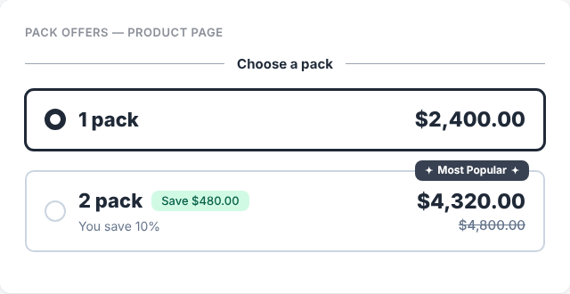
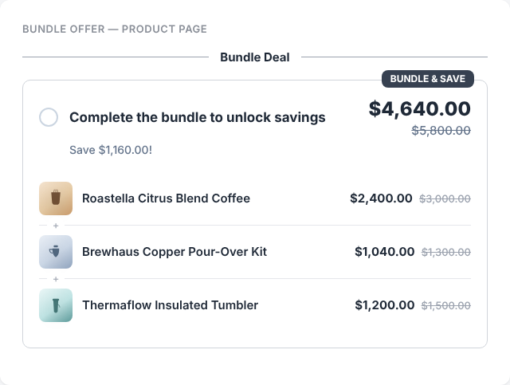
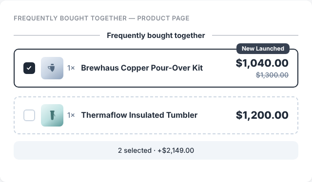

# Smart Bundles for WooCommerce

A free open-source WooCommerce plugin that helps store owners increase average order value using:

- Pack Offers
- Bundle Deals
- Frequently Bought Together

## Features

### Pack Offers

Create quantity-based offers:

- Packed option - Create Bulk sale Option 
- Custom discounts
- Product badges

### Bundle Offers

Create product bundles:

- Multiple products
- One combined price
- Discount display
- Custom heading

### Frequently Bought Together

Recommend related products:

- Manual selection
- Category based products
- Tag based products
- WooCommerce related products

## Screenshots

### Pack Offers

### Bundle Offer

### Frequently Bought Together

## Installation

1. Download plugin
2. Upload to:

wp-content/plugins/

3. Activate plugin from WordPress dashboard.

## Future Roadmap

Coming soon:

- Top-selling product recommendations
- Advanced AI product suggestions
- More quantity tiers
- Export/import settings
- More customization options

## Contributing

Pull requests are welcome.

Help improve Smart Bundles by adding:

- New features
- Bug fixes
- UI improvements

## License

MIT License
